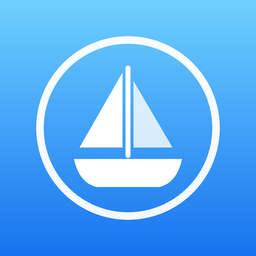
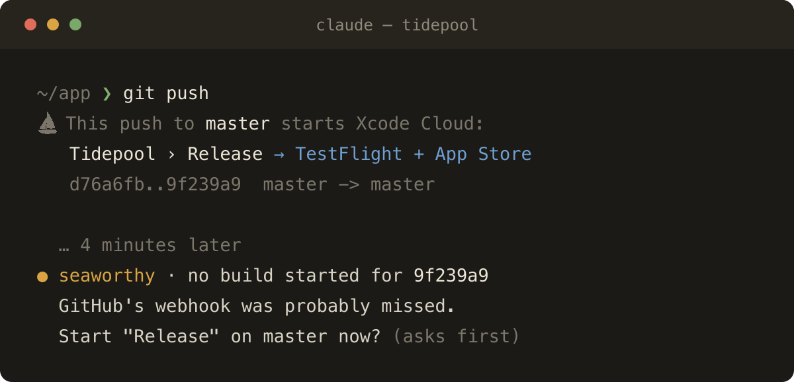
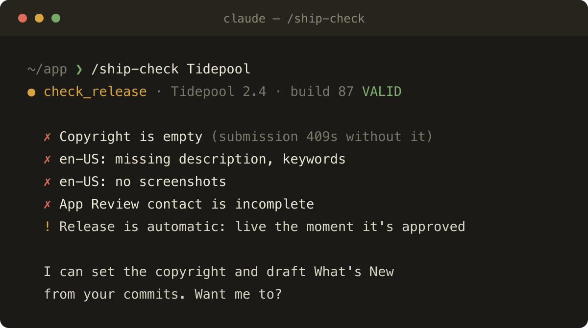

<p align="center">
  
</p>

<h1 align="center">Seaworthy</h1>

<p align="center">
  <b>Ship iOS apps from Claude Code.</b><br>
  Xcode Cloud and App Store Connect, driven by Claude, with your own API key.
</p>

<p align="center">
  
  
  
</p>

<p align="center">
  
</p>

## Why

Xcode Cloud and App Store Connect fail quietly:

- **A push is a release.** If a workflow watches the branch, a docs-only commit lands on testers' phones.
- **Builds sometimes never start.** GitHub's webhook to Xcode Cloud gets dropped now and then. Nothing errors; nothing runs.
- **Submissions fail on details.** A missing copyright, an unanswered export-compliance question, or a rejected submission still holding the version each stop you with an unhelpful 409.

Seaworthy puts all of that where Claude can see it, and lets Claude fix it, asking you first.

## What it does

**⛵ Tells you what a push ships, and stops one that can't.** Before `git push`, one line names the Xcode Cloud workflows it starts and where the builds go. If the commit is still stamped with a version Apple already approved, it asks first: that build would archive for minutes and then be refused at upload.

**🛟 Catches the build that never started, and the one that failed.** After a push, Seaworthy watches in the background. If no build appears within 4 minutes, or the build fails, Claude hears about it. It offers to start the missing build, or names the failure's cause (a closed version train, a compile error at `file:line`, a failing test) and the fix.

**🧭 Checks a release before Apple does.** `/ship-check` lists every blocker with its fix, then fixes what it can.

<p align="center">
  
</p>

**🚀 Submits for review, with a plan you approve.** Creates the version, writes What's New from your commits, attaches the build, and submits. After a rejection, it clears the stale submission first. Anything irreversible shows you the exact plan and waits for a yes.

## Quick start

```sh
claude plugin marketplace add sivori/seaworthy
claude plugin install seaworthy@seaworthy
```

Then add your App Store Connect API key under `/plugin` → Seaworthy → Configure:

1. **`key_id`** and **`issuer_id`**: from App Store Connect → Users and Access → Integrations → App Store Connect API. Use the **App Manager** role to create versions and submit; **Developer** is enough for everything else.
2. **`private_key`**: the downloaded `AuthKey_<key_id>.p8`. The field holds one line, so copy it flattened:
   ```sh
   tr -d '\n' < AuthKey_XXXXXXXXXX.p8 | pbcopy
   ```
   It's a sensitive setting, stored in your system keychain.

Needs Node 18+. There's nothing to `npm install`.

## Try asking

- *"What's Xcode Cloud doing for this app?"*
- *"Why did the last build fail?"*
- *"Is 2.4 ready to submit?"* or just `/ship-check`
- *"Create version 2.5 and write the release notes from what changed since 2.4."*
- *"Submit 2.5 for review with build 91."*

<details>
<summary><b>All tools</b></summary>

| | Tool | |
|---|---|---|
| Read | `list_apps` | Apps in the account and which use Xcode Cloud |
| | `ci_status` | Workflows (what starts them, where builds go) and recent runs |
| | `triage_run` | Why a run failed; `log_excerpt` greps the log bundle |
| | `find_run_for_commit` | Did this commit build? |
| | `check_release` | Blockers, warnings and manual checks for a submission |
| | `review_status` | Versions, open review submissions, next version number |
| Draft | `create_version` | New App Store version; refuses closed trains |
| | `update_version` | Version string, copyright, release type, What's New. Won't overwrite without `overwrite` |
| Irreversible | `start_build` | Start a workflow on a branch |
| | `submit_for_review` | Cancel stale → attach build → submit |

Plus the `shipping` skill, which carries the traps (closed version trains, missed webhooks, export compliance, common rejections), and the `/ship-check` command.

**Irreversible tools ask first.** Called without a token, they change nothing and return the plan plus a `confirm` token, which is a hash of that plan. Calling again with the token rebuilds the plan from live state and runs only if nothing changed, so an approval can't stretch to cover a different action.

Settings: `push_warning` and `build_watch` turn the two push hooks off (both on by default).

</details>

<details>
<summary><b>Security and privacy</b></summary>

- **Your key stays local.** The private key lives in the system keychain as a sensitive plugin setting. Seaworthy reads no key files or other tools' credentials. The key signs short-lived (10-minute) tokens, sent only to `api.appstoreconnect.apple.com`. There's no Seaworthy server, no telemetry and no dependencies.
- **What reaches the model:** app and build metadata, workflow settings, run results, commit subjects, and error and test messages from your builds. The App Review demo-account password is never read into a tool result. Error lines from build logs (`log_excerpt`) pass through a filter that masks token-shaped strings, but it can't catch every secret a script prints, so keep secrets out of CI logs.
- **Confirmation is a guard, not a lock.** The confirm token makes Claude show you the plan before acting, and goes stale if anything changes, but Claude receives the token in the same response. The real boundary is Claude Code's permission prompt. **Don't add `start_build` or `submit_for_review` to your allowed tools.** Build logs and commit messages are untrusted text, and the prompt is what stops an instruction hidden in them.
- **Hooks** run `git` read-only (`rev-parse`, `remote get-url`) and make App Store Connect GETs. They never modify your repo or your account. A small cache of your Xcode Cloud workflows lives at `~/.cache/seaworthy/` (mode 600).
- **Least privilege:** a Developer-role key covers everything except creating versions and submitting.

</details>

## Development

```sh
npm test                    # unit tests, no network
claude --plugin-dir .       # try it locally
SEAWORTHY_DEBUG=1           # hooks print errors instead of staying silent
node docs/gen-cards.mjs     # re-render the README screenshots
```

## License

MIT
